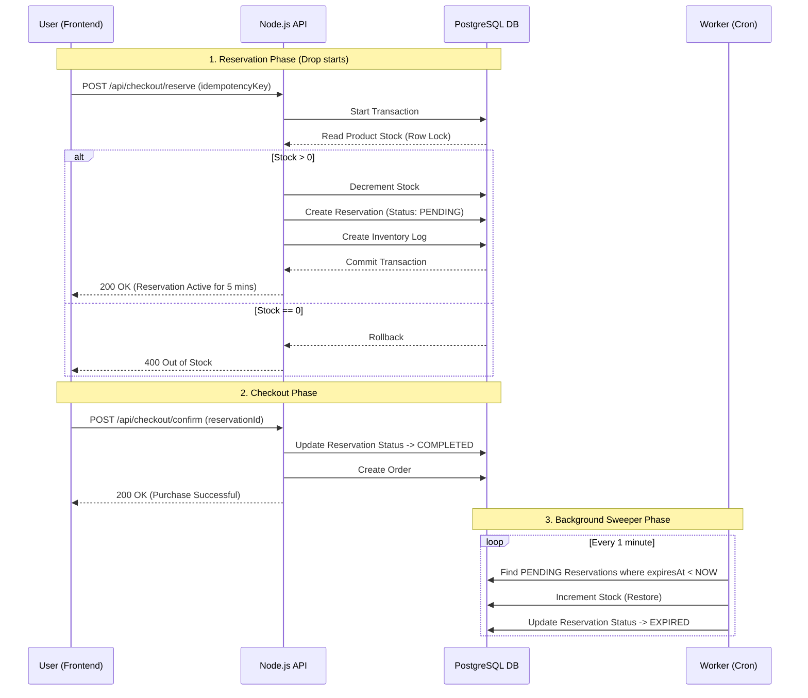

# Limited Drop Sneaker Store 👟🚀

A high-performance reservation and checkout system built for "limited stock drop" scenarios, where thousands of users compete for the same inventory simultaneously.

## 🏗️ Architecture Diagram


---

## 🧪 How to Verify (For the Reviewer)

This project includes a **Concurrency Simulation Script** to prove that race conditions are handled correctly and stock never goes negative.

1. **Start the environment (Local)**
   Ensure the database and server are running:
   ```bash
   docker-compose up -d
   npm run dev -w backend
   ```

2. **Run the 100-User Concurrency Test**
   Run the following command from the root directory:
   ```bash
   npm run test:concurrency -w backend
   ```
   *To run against a deployed URL (e.g. pxxl.app):*
   ```bash
   npm run test:concurrency -w backend -- https://your-app.pxxl.app
   ```

**What the script does:**
- Registers a temporary test user and logs in.
- Fetches the current stock of the first available product.
- Fires **100 concurrent POST /reserve requests** in parallel (`Promise.allSettled`).
- Asserts that exactly `N` requests succeed (where `N` is the available stock), and the remaining fail with `409 Out of Stock`.
- Asserts that the final stock is never negative.

---

# Product Drop System Architecture

## 1. How race conditions were handled
To protect against race conditions during concurrent requests, the "read-modify-write" pattern in Node.js memory was strictly avoided [1, 2].
Instead, atomic database operations were utilized: stock deduction occurs via an atomic decrement operator with a simultaneous stock check (`WHERE stock >= quantity`) inside a single `prisma.$transaction` [1].
To prevent duplicate requests during network failures (network retries), strict API idempotency was implemented: every reservation request includes a unique `idempotencyKey` validated by a database unique constraint [3].

## 2. Why certain schema decisions were made
*   **ACID Transactions:** A relational database (PostgreSQL) was chosen because of its native support for ACID (Atomicity, Consistency, Isolation, Durability) properties, which is critical for financial and inventory operations, unlike NoSQL solutions where strict consistency requires complex programmatic implementations [4, 5].
*   **Composite Indexes:** An `@@index([status, expiresAt])` was added to the `Reservation` table [6]. This prevents Full Table Scans by the background worker (Cron) searching for expired reservations.
*   **Referential Integrity:** Strict `onDelete: Restrict` constraints were applied to relation models (e.g., `Order`) to prevent orphan records from accidental deletion of products or users [7].
*   **Audit Trail:** An `InventoryLog` table was introduced to record every stock change. The log entry is created strictly atomically within the same transaction as the stock deduction [7].

## 3. Trade-offs
*   **Relational DB vs NoSQL:** Choosing PostgreSQL guarantees strict consistency and transaction reliability [4], but horizontally scaling (sharding) a relational database is significantly more complex compared to NoSQL databases [8].
*   **Polling vs WebSockets:** Using client-side polling every 5 seconds for stock updates simplifies the frontend and backend architecture, but creates redundant background load on the server (compared to a push model via WebSockets) [9].
*   **Optimistic vs Pessimistic Locking:** An optimistic approach (via atomic decrement) was used [10, 11]. This provides high throughput, but during massive concurrent requests for a single item, many requests will be rejected by the database. Pessimistic locking (`SELECT ... FOR UPDATE`) would solve this by queueing requests, but would drastically reduce system throughput.

## 4. What would break at 10k concurrent users
*   **Lock Contention:** 10,000 users attempting to simultaneously update a single `Product` row (the stock of a specific item) will cause severe lock contention at the database level, leading to a cascading spike in lock timeouts [12, 13].
*   **Connection Pool Exhaustion:** The Node.js process (or cluster) will rapidly exhaust its connection limit to PostgreSQL, as each transaction will hold a connection waiting for a response from the overloaded disk.
*   **Event Loop Blockage:** The single-threaded Node.js Event Loop will be overwhelmed by parsing 10,000 JSON requests and handling polling, increasing latency to unacceptable levels and causing false timeouts [14].
*   **Self-DDoS:** Client-side polling (every 5 seconds) from 10,000 active browser tabs will generate a steady 2,000 requests per second (RPS) purely for stock reads, which will crash the API without caching [15, 16].

## 5. How you'd scale it
*   **Implementing a Message Queue (Decoupling):** Decoupling the synchronous HTTP request from heavy database writes. Incoming reservation requests should be pushed to a queue (RabbitMQ, Redis Streams, or BullMQ), while background workers process them at a controlled rate, preventing database overload [17, 18].
*   **Defensive Caching:** Offloading catalog and stock read operations to an In-Memory Cache (Redis). This will relieve load from PostgreSQL (read-scaling) [19-21].
*   **Rate Limiting at the Gateway Level:** Implementing strict request rate limiting (e.g., Token Bucket algorithm) at the Nginx, HAProxy, or API Gateway level before the traffic even reaches the Node.js servers [22, 23].
